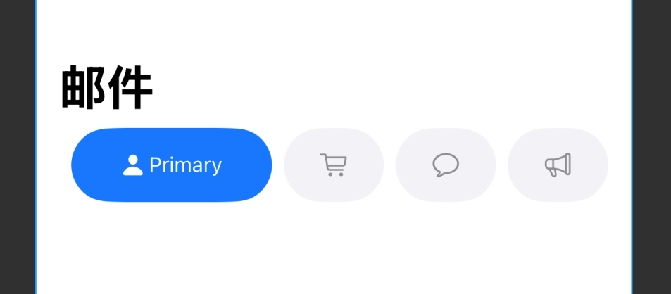

# SegmentButtonKit
一个动态样式的 SwiftUI 标签切换组件，支持图标 + 文字，选中后自动展开。适用于顶部分类、页面导航、消息分段等。



## ✨ 特性亮点

- 🎯 支持最多 4 个按钮（自动限制）
- 🎨 支持自定义颜色 / 圆角 / 选中状态样式
- 📱 自适应宽度：选中项占用双倍空间
- 🔗 支持外部状态绑定（`@Binding selectedIndex`）

---

## 📦 安装方式（Swift Package Manager）

```text
https://github.com/lovewhitemagic/SegmentButtonKit.git


在 Xcode 中选择 `File > Add Packages...`，输入上方地址即可。

---

## 🚀 使用示例

```swift
import SegmentButtonKit

struct ExampleView: View {
    @State private var selectedIndex = 0

    var body: some View {
        SegmentButtonsView(
            items: [
                .init(icon: "person.fill", title: "我"),
                .init(icon: "cart", title: "购物"),
                .init(icon: "bell", title: "通知"),
                .init(icon: "heart", title: "收藏")
            ],
            selectedIndex: $selectedIndex,
            selectedBackgroundColor: .purple,
            unselectedTextColor: .gray,
            cornerRadius: 20
        )
    }
}


## 💡 使用场景

| 场景                   | 说明                         |
|------------------------|------------------------------|
| 邮件 / 社交类 App 标签 | 切换分类模块                 |
| 电商首页               | 推荐 / 热门 / 收藏 / 价格    |
| 财务 App               | 收入 / 支出 / 投资 / 报表    |


## 👨‍💻 作者
由 @lovewhitemagic 创建。欢迎 Star ⭐️ 或提 PR！